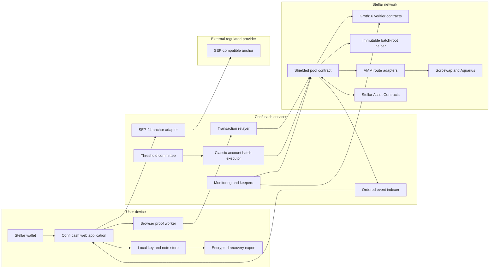
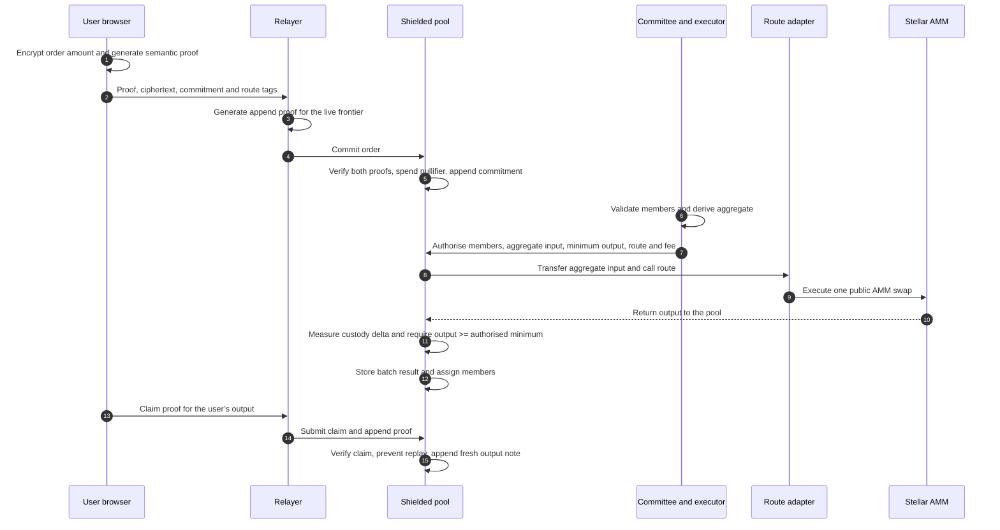
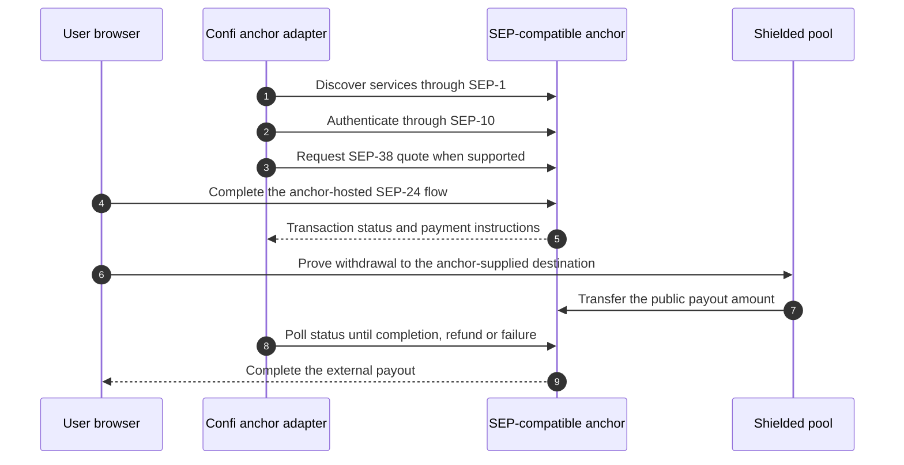

**Stellar Community Fund #45 · Build Award · Open Track**<br />**Document status:** Submission draft<br />**Project status:** Protocol proof of concept on Stellar testnet<br />**Lead developer:** Gbolahan Onadeko<br />**Product:** [https://confi.cash/](https://confi.cash/)<br />**Source:** [https://github.com/Confihub](https://github.com/Confihub)

---

## 1. Purpose and scope

Confi.cash is a confidentiality layer for people and organisations using Stellar. It lets a user protect an asset balance, make payments, join a shared batch swap, and later return to an ordinary Stellar account or a supported anchor flow.

The product is not an anonymity network. Deposits and withdrawals remain visible on Stellar, and a relayer can observe request timing and network metadata. Confi.cash is designed to protect the amounts and ownership relationships inside the shielded pool while preserving public settlement, asset custody, and accountable exits.

The project is currently a protocol proof of concept, not a launched product. The existing evidence consists of Soroban contracts, proof circuits, operator tooling, and testnet transactions showing that the core mechanism can execute. The public product documentation illustrates the intended testnet experience; it is not evidence of a production-ready application or integration. No production-ready end-user application, public trusted-setup ceremony, independent security review, Soroswap or Aquarius adapter, or production anchor integration is claimed as completed work.

The target system is designed to move through three release states:

1. an MVP with the first end-user web application and upgraded protocol;
2. a public testnet release with production ceremony keys, mobile browser support, an SDK, and live AMM adapters; and
3. an independently reviewed, controlled mainnet launch.

This document describes the technical system and its release boundaries. Delivery milestones, schedules, acceptance criteria, and budget remain in the submission form.

---

## 2. Current proof and target architecture

| Area | Exists today | Production target |
| --- | --- | --- |
| Shielded protocol | Testnet pool and Groth16 verifiers | Reviewed mainnet release |
| Note tree | Depth 16: 65,536 leaves | Depth 24: 16,777,216 leaves |
| Batch size | Up to five orders | Up to eight orders |
| Preferred v2 batch path | Present in public v12 source; not deployed | Deployed, tested, and used by the application |
| User application | No production-ready end-user application claimed | Responsive web application with browser proving |
| Relayer and indexer | Operator proof-of-concept tooling | Durable public services with monitoring |
| Recovery | No supported recovery flow | User-held encrypted recovery, offline withdrawal, and timed reclaim of unexecuted orders |
| Trusted setup | Development keys; no public multi-party ceremony | Verified BLS12-381 Phase-1 record and public Phase-2 ceremony |
| AMM routing | Reference AMM and adapter pattern | Soroswap and Aquarius testnet adapters; Soroswap mainnet route |
| Anchor payout | No production anchor integration | SEP-1/10/24/38 adapter with a documented contingency |
| Administration | Testnet operator configuration | Published classic-account multisig policy |
| Operations | No production monitoring period | Keepers, status page, drills, and 14-day observation |

The named testnet showcase run, `20260724-candidate-showcase-04`, completed 115 of 115 submitted transactions across 30 operator-controlled test identities and six five-member batches. This is execution evidence, not user traction, an independent confidentiality set, or a security audit.

The current deployment manifest and verification script are public:

- [https://github.com/Confihub/confibatch\_pool/blob/main/DEPLOYMENTS.md](https://github.com/Confihub/confibatch_pool/blob/main/DEPLOYMENTS.md)
- [https://github.com/Confihub/confibatch\_pool/blob/main/scripts/verify-deployments.mjs](https://github.com/Confihub/confibatch_pool/blob/main/scripts/verify-deployments.mjs)

They identify the live v10 pool, its Wasm hash, 11 verifier contracts, and the verifier-key hashes. They do not claim that the current v12 source reproduces the historical v10 deployment. The production release pipeline will bind each tagged release to its source commit, Wasm hashes, contract IDs, circuit hashes, and ceremony-derived verifier keys.

---

## 3. Target architecture



### User device

The browser is the user’s confidentiality boundary. It derives shielded spend, viewing, and receive-key material from a versioned, domain-separated wallet message signature that includes the Stellar network passphrase. It stores note material locally, scans encrypted event payloads, constructs transactions, and generates the user’s proofs.

Wallet support will be based on a tested compatibility matrix. The application will not claim support for a wallet until its message-signing behaviour is deterministic and compatible with the key-derivation flow.

The application exposes a checksummed, network-specific `cb1...` shielded receive address containing only public receive material. It does not contain the user’s private keys or encode their public Stellar `G...` address. A sender obtains this address through a trusted channel, validates its version and network, and encrypts the new note for that recipient. The recipient discovers the note by scanning public event ciphertexts locally. A note sent to the wrong valid shielded address cannot be recovered by Confi.cash.

The application will provide a user-held encrypted recovery export. The recovery secret and spend material remain under the user’s control. Operator-hosted recovery custody, social recovery, and threshold recovery are outside the initial release architecture.

### Relayer

Proof-authorised internal operations do not require the note owner to be the Stellar transaction source. The relayer submits those operations and pays their network fees. It also generates the append proof that binds a new commitment to the live tree frontier.

The relayer does not receive spend keys or note openings, but it does observe the incoming request, its timing and network metadata, the public proof statement, and the resulting transaction. Relayer privacy is therefore a documented limitation.

Deposits are different: the public depositor must authorise the Stellar Asset Contract transfer into the pool. The application must present this public boundary clearly rather than implying that every action is completely signature-free or fee-free for the wallet.

Screening is a service policy at visible public boundaries, not an identity rule inside shielded notes. The Confi.cash relayer may decline to sponsor a request associated with a public depositing address or public withdrawal destination on a published sanctions list. That refusal does not alter proof validity or give the relayer authority over an ordinary withdrawal: a user can submit the same valid withdrawal from another funded transaction source. An anchor applies its own identity, screening, monitoring, and reporting rules to its hosted flow.

### Indexer

The indexer reads public pool events and serves them in canonical ledger order. It does not maintain authoritative private balances. The browser reconstructs its own note set by scanning encrypted event payloads and matching those it can decrypt.

Event order and commitment indices are security-relevant because they determine Merkle paths. The production indexer will check for gaps, duplicates, reordering, and index discontinuities and will expose a rescan path for clients.

### Threshold committee and executor

Individual swap amounts are encrypted using exponential ElGamal over Jubjub. The scheme is additively homomorphic: committee nodes combine valid ciphertexts and normally decrypt only the aggregate required for settlement. Order amounts are bounded so the resulting discrete logarithm can be recovered over a finite range.

The initial mainnet profile uses three committee shares with a two-of-three decryption threshold. The corresponding batch-executor classic account uses three published signers and a two-of-three authorization threshold. Private decryption shares are held in separate operator credential boundaries, but all three are operated by Confi.cash; this protects against one unavailable or compromised share, not against the organisation as a whole.

A verifiable distributed key-generation ceremony creates the committee key without constructing the complete private key on one machine. Its public commitments and transcript are published, while private shares remain local to the three committee nodes. Each partial decryption carries a proof that it was produced from the committed share; executor software verifies two valid shares before combining them and authorising the batch.

A quorum has the technical ability to decrypt an individual ciphertext, so the launch committee remains a trust assumption even though its normal procedure uses aggregate decryption only. If quorum is unavailable, new swap batches stop; the system never falls back to plaintext orders or single-party decryption.

The committee public key, share commitments, executor account, signers, thresholds, supported amount range, and key-generation record are included in the signed release manifest. Rotation pauses new order commitments, lets pending orders settle or expire into the reclaim path, publishes a replacement profile, and resumes only after configuration verification. If any committee key is circuit-bound, its rotation requires a new circuit release and ceremony-derived verifier.

The pool requires both the configured administrative authority and the configured batch executor for aggregate execution. A multi-organisation committee is deferred.

### Soroban contracts

The shielded pool holds registered assets through their Stellar Asset Contracts, stores the note root and frontier, records spent nullifiers, verifies state transitions through dedicated verifier contracts, executes aggregate AMM routes, records batch results, and applies per-asset accounting controls.

Each Groth16 verifier instance stores one circuit key. This prevents that instance’s key from being replaced after initialisation, but it does not by itself prevent the pool from being wired to the wrong verifier contract. The release pipeline therefore verifies both the key held by every verifier and the pool slot to which each verifier is assigned.

The production verifier will use a constructor-bound key so there is no deploy-to-initialise race.

---

## 4. User flow

### A. Protect a balance

1. The user connects a supported Stellar wallet.
2. The browser derives the shielded identity and verifies that the wallet returns a stable signature for the derivation message.
3. The user selects a supported asset and a public deposit amount.
4. The wallet authorises the asset transfer into the pool.
5. The deposit proof binds the asset, amount, new commitment, and tree transition.
6. The contract transfers the asset into custody, verifies the proof, advances the note tree, and emits the encrypted note payload.

The deposit asset, amount, payer and timing are public. The resulting shielded note is not stored against a public wallet address.

### B. Use the protected balance

A shielded note can be spent through a private payment, split into new notes, committed to a batch swap, or withdrawn. The proof shows that the transition is valid without revealing the note opening.

For a payment, the input nullifier becomes public and a fresh output commitment is appended. The transferred amount and the link between the spent note and the new note are not published as plaintext.

For a swap, several compatible encrypted orders are grouped into one batch and the aggregate is sent to an existing Stellar AMM. This is how Confi.cash preserves access to existing liquidity rather than building a separate private exchange.

### C. Return to public or regulated rails

The user may withdraw to an ordinary Stellar destination or use a supported anchor flow. The withdrawal amount, destination asset and timing are public. The proof binds the destination so a relayer cannot redirect the transfer.

For an ordinary spendable note, the guaranteed protocol exit is the on-chain withdrawal path. An unexecuted swap commitment first returns to a spendable note through timed reclaim. Anchor availability is an integration dependency and is not required for either path.

For the launch assets:

- XLM can be delivered only to an existing funded Stellar account.
- USDC or another classic issued asset requires a compatible destination account and trustline.

A payout to a never-activated `G...` address is therefore not a launch claim for XLM or USDC.

---

## 5. Batch swap architecture

The batch swap is a shielded order-entry and aggregate execution system. It is not a new AMM and does not replace Soroswap or Aquarius.



### Commit

The user proves ownership of a valid input note and binds the encrypted order, route assets, nullifier, and swap commitment. The user’s semantic proof is independent of the current append frontier; the relayer supplies a second proof for the live tree transition. This prevents a slowly generated browser proof from becoming stale whenever another user appends a note.

Each commitment records the ledger sequence at which it became available and a protocol-wide expiry interval. Until assignment, its state is `Available`; successful execution changes it atomically to `Assigned`.

### Timed reclaim

If an order remains `Available` past its expiry, the owner can reclaim it into a fresh shielded note. The reclaim proof binds ownership of the committed order, its asset and hidden amount, a single-use reclaim nullifier, and the refund commitment. A separate append proof binds the refund commitment to the current tree frontier.

Before expiry, batch execution may assign an `Available` order and reclaim is rejected. At or after expiry, batch execution rejects that order and only a valid reclaim may consume it. The contract marks it `Reclaimed`, records the reclaim nullifier, and appends the refund note in one transaction. No asset leaves custody and total shielded liability is unchanged. Any funded Stellar account may submit the valid reclaim, so committee or relayer disappearance cannot strand an expired order.

### Aggregate execution

The batch executor authorises the exact ordered members, aggregate input, minimum acceptable output, selected route, fee, and batch identifier. These values are threshold-authorised; the current preferred v2 design does not prove that the committee derived an honest aggregate or that every user’s individual price limit was enforced on-chain.

The pool sends the aggregate batch input to the configured route. It then measures its actual output-token balance before and after the call. Settlement reverts unless the received amount meets the authorised minimum.

This custody-delta check prevents an adapter from making the pool account for output it did not receive. It does not make a dishonest committee harmless: a quorum can still authorise an unfavourable aggregate or minimum. That residual trust is disclosed and is one reason mainnet exposure begins under a low liability ceiling.

In this architecture, the AMM input is the batch’s total routed `sum_in`. It is not described as a net imbalance between opposing private order books.

### Claim

After settlement, each participant proves their entitlement against the stored batch result and receives a fresh shielded output note. Claim nullifiers and the stored participant capacity prevent duplicate or excess claims.

### AMM adapters

The existing code includes a reference AMM and an adapter pattern, not a completed Soroswap or Aquarius integration.

The planned routing path is:

- Soroswap and Aquarius adapters are first demonstrated on testnet.
- Soroswap routing is activated on mainnet after security review.
- The Aquarius adapter is published and verified, but its mainnet route remains unset if available liquidity cannot satisfy the configured execution threshold.

The venue sees the public aggregate swap and the pool address. It does not receive each participant’s plaintext order from the protocol. Timing, batch membership, small batches, committee access, and outside information can still support inference.

---

## 6. Notes, proofs, and state

### Shielded notes

Value is represented as asset-tagged commitments rather than balances keyed by a Stellar address:

```text
commitment = Poseidon(asset, amount, owner key, nullifier seed, randomness)
```

The note opening and ownership keys remain off-chain. The contract stores commitments, the current Merkle root and frontier, and a ring of recent roots.

The current tree has 65,536 leaves and no production migration path when full. The production revision raises the tree to 16,777,216 leaves before the production ceremony. The new mainnet pool will be deployed fresh at the final depth; value is not migrated from the proof-of-concept testnet pool.

### Proof system

Confi.cash uses Groth16 over BLS12-381 so verification can use Stellar’s native BLS12-381 host functions. User proofs are generated off-chain and verified by Soroban contracts.

The circuit source is not public today. Until it is published, an outside reviewer can inspect the generic verifier and pool call shape but cannot independently confirm every constraint enforced by the development keys.

Before the public testnet release:

1. the production circuit set is finalised and hashed;
2. circuit source, R1CS files, exact constraint counts, and public-input layouts are published;
3. the largest circuit is mapped to the next supported power-of-two domain with at least 25 percent capacity headroom;
4. a compatible BLS12-381 Phase-1 transcript is selected, independently verified, and published with its source, capacity, contribution record, and cryptographic hash;
5. if no compatible public transcript satisfies that requirement, a public project-specific Phase-1 ceremony is completed before Phase-2 rather than reducing the committed tree depth or silently changing circuits;
6. a public multi-party Phase-2 ceremony is run for each frozen circuit;
7. the resulting proving keys, verifying keys, contribution records, and transcript checks are published;
8. fresh verifier contracts are deployed with constructor-bound keys; and
9. the deployment manifest verifies every key, contract, Wasm hash, and pool registry slot.

Any circuit change after the freeze requires a new ceremony for that circuit.

### Nullifiers and archival state

Every spend records a nullifier so the same note cannot be spent again. Nullifiers, unclaimed batch records, verifier instances, and the pool’s instance state must remain live.

Permissionless keepers renew the entries exposed by the contracts. External footprint-extension automation covers verifier instances that do not have their own keeper method. The indexer maintains an off-chain mirror for detection and recovery planning, but the Stellar ledger and archive remain authoritative. Off-chain data is never treated as permission to recreate only part of the spent set.

---

## 7. Custody and solvency controls

For every supported asset, the pool tracks outstanding shielded liabilities and accrued protocol fees. After value-changing operations it enforces:

```text
live SAC balance of the pool >= outstanding shielded value + accrued fees
```

The current exact liability view is administrator-authenticated because it can reveal activity for a low-volume asset. Therefore exact solvency is contract-enforced but not independently reconstructible by every observer today.

The mainnet controls add:

- a public per-asset liability ceiling;
- an on-chain solvency-status view that reports whether the invariant holds without exposing the exact private liability;
- monitoring that compares live custody and internal accounting and publishes status;
- alerts before the configured ceiling is reached; and
- an explicit inflow-pause control.

The ceiling and pause apply only to transitions that create new exposure. Withdrawals, valid claims from already executed batches, and other liability-reducing exits remain available. This rule is tested directly so setting a ceiling below current liabilities cannot accidentally block withdrawals.

The mainnet release starts with a low public ceiling. Raising it is a separate multisig action reflected in the public configuration and status history.

---

## 8. Anchor integration

The anchor adapter is built as a standards client, not as an identity or banking system.



The adapter supports:

- SEP-1 discovery;
- SEP-10 authentication using a session-specific account where the selected anchor supports it;
- SEP-24 interactive withdrawal; and
- SEP-38 quotes.

KYC takes place on the anchor’s hosted SEP-24 surface. The initial architecture does not include a SEP-12 customer-information client, and Confi.cash does not receive identity documents from the hosted flow.

The selected anchor’s account, memo, quote, timing, authentication, and refund behaviour must be tested before any mainnet route is enabled. The adapter does not initiate the on-chain payment until the anchor reports that it is ready to receive funds.

If no production relationship is available, completion is demonstrated against a named compatible public testnet anchor and the adapter remains disabled on mainnet. The application continues to offer ordinary on-chain withdrawal.

The initial architecture does not include a private refund circuit. If an anchor’s refund behaviour cannot safely return funds to the correct user without creating an unreviewed custody path, that anchor is not enabled.

---

## 9. Administration, upgrades, and user exit

Mainnet administrative authority is held by a classic Stellar account with three published signers and a two-of-three threshold. The same principle applies to the batch executor: authority is visible in native Stellar account state rather than hidden inside a mutable off-chain policy.

The production release uses:

- constructor-bound verifier keys;
- a signed deployment manifest;
- one-way verifier and upgrade freeze controls;
- a documented decision on when each freeze is activated;
- public configuration readback after deployment; and
- a mainnet-specific Wasm surface.

The mainnet release candidate does not export the legacy settlement and confidential-LP entrypoints retained by the proof-of-concept source. Mainnet is a fresh deployment, so historical testnet ABI compatibility is not a reason to carry those paths into the reviewed launch build.

An ordinary shielded withdrawal requires no relayer, committee, or batch-executor authority. The offline exit tool packages the public artifacts needed to reconstruct and submit a withdrawal. A user submitting without any relayer must still have access to Stellar RPC and a funded transaction source for network fees. Until the one-way production freeze is executed, multisig contract-upgrade authority remains a disclosed trust assumption.

This protects against disappearance of the Confi.cash website or relayer. It does not override Stellar network availability, an asset issuer’s native controls, or any contract upgrade authority that remains unfrozen.

An order that has already been committed but not assigned to an executed batch uses the timed reclaim path described above. Mainnet swaps remain disabled until the reclaim circuit, contract transition, expiry policy, race behaviour, and offline submission path have passed independent review.

---

## 10. Security and privacy boundaries

### Protected by the protocol

- plaintext note values inside the pool;
- direct links between a spent note and its fresh output;
- individual payment amounts inside the pool;
- individual batch order sizes from public chain observers and the AMM;
- double-spending, through nullifiers;
- withdrawal redirection, through proof-bound recipients;
- false AMM output accounting, through measured custody delta; and
- operation without the Confi relayer for proof-authorised withdrawals.

### Public or observable

- deposit and withdrawal assets, amounts, destinations and timing;
- commitments, nullifiers, batch records, routes and aggregate AMM execution;
- the fact that the pool and its contracts were used;
- network metadata available to the relayer;
- identity and payout data provided directly to an anchor; and
- administration, multisig signers, configured ceilings and deployed code.

### Trusted or only partially constrained

- the user’s device and wallet;
- the correctness of circuits and ceremony until independently reviewed;
- a threshold quorum, which can reconstruct individual order amounts;
- the batch executor, which knows the aggregate before execution;
- administrative upgrade authority until frozen;
- the selected anchor and its refund behaviour;
- the supported asset issuer’s native authorization controls; and
- operational renewal of archival state.

Small batches do not create a strong confidentiality set merely because the contract accepts them. The application displays the realised batch size before commitment and describes capacity as a limit, not as proof of independent participants.

Screening by the Confi.cash relayer is not a protocol-level compliance guarantee. It applies only where a public address is available to the service, can be bypassed by submitting a valid proof-authorised transaction through another source, and cannot identify the owner of an internal shielded note. Regulated anchors remain responsible for controls at their boundary.

---

## 11. Mainnet launch profile

The first mainnet release is intentionally narrow:

- assets: XLM and USDC only;
- product surfaces: deposit, protected balance, payment, split, v2 batch swap, claim, withdrawal, recovery, and offline exit;
- order safety: timed reclaim enabled before batch swaps;
- AMM route: Soroswap active after review;
- Aquarius: adapter published, route conditional on usable liquidity;
- anchor: one SEP-24 adapter under the published contingency;
- administration: classic-account multisig;
- exposure: low public per-asset ceiling;
- operations: monitored services and permissionless keepers; and
- observation: a 14-day monitored period before broader availability.

The following are not part of the mainnet launch:

- confidential LP positions;
- legacy settlement entrypoints;
- native mobile applications;
- assets or routes beyond XLM and USDC;
- classic SDEX or path-payment routing;
- a runtime best-execution router;
- a multi-organisation threshold committee;
- selective-disclosure tooling;
- an Association Set Provider integration;
- agent or MCP-initiated spending;
- social or threshold recovery; or
- more than one anchor.

---

## 12. Mainnet gates and residual limitations

### Hard launch gates

Mainnet deployment does not proceed until every hard gate below is resolved:

1. The preferred v2 commit, execute, claim, and timed-reclaim paths run end to end on public testnet using the release-candidate contracts.
2. Production circuit source, R1CS files, constraint counts, Phase-1 record, Phase-2 contributions, proving keys, and verifying-key hashes are published and independently reproducible.
3. Every verifier is constructor-bound, every pool registry slot is checked against the intended verifier, and the signed release manifest matches the tagged source and deployed Wasm.
4. An independent review covers the frozen circuits, contracts, reclaim path, AMM adapters, browser-critical key handling, deployment process, and operational controls. Every critical and high finding is remediated and verified; none may be accepted as residual risk.
5. Depth-24 proofs complete without memory failure across the published mobile-browser matrix.
6. The two-of-three committee and executor profiles, key-generation record, signers, thresholds, and incident procedures are published and tested.
7. The per-asset ceiling, solvency-status view, inflow pause, withdrawal preservation, and timed reclaim pass positive and adversarial tests.
8. Nullifier, batch, verifier, and instance archival restoration drills complete without losing replay protection or claim state.
9. Soroswap routing passes the reviewed mainnet activation checks. Aquarius and the anchor remain disabled unless their separate activation conditions are satisfied.

### Disclosed residual limitations

The following limitations may remain at launch because they describe the chosen trust model rather than unfinished hardening:

1. The committee is operated by one organisation, and a two-share quorum can reconstruct an individual order amount.
2. The preferred v2 design does not prove committee aggregate honesty or each user’s price limit on-chain.
3. The relayer observes request timing and network metadata.
4. A batch capacity of eight is not a guarantee of eight independent participants.
5. Soroswap, Aquarius, the asset issuer, and any anchor are third-party dependencies.
6. XLM and classic issued assets require the destination account and asset prerequisites imposed by Stellar.
7. Administrative upgrade authority remains a trust assumption until the documented one-way production freeze is executed.
8. Long-term nullifier and verifier availability depends on keeper operation and tested restoration procedures.

The independent review and launch report may document these residual limitations, but it cannot waive a hard launch gate.

---

## 13. Open-source and verification commitments

The existing contracts are published under Apache-2.0. The production release will also publish:

- production circuit source and R1CS files;
- Phase-1 and Phase-2 contributions, transcript checks and derived key hashes;
- tagged contract and client releases;
- signed deployment manifests;
- committee key-generation records and published executor configuration;
- Soroswap, Aquarius and anchor adapters;
- TypeScript SDK and example application;
- recovery, timed-reclaim, and offline exit tools;
- test vectors and benchmark results; and
- monitoring and launch reports.

Every mainnet release record will map:

```text
source commit
→ circuit and R1CS hashes
→ ceremony output and verifier-key hashes
→ contract Wasm hashes
→ deployed contract IDs
→ configured verifier slots, assets, routes, ceilings and multisig accounts
```

That record is the reproducible boundary between the reviewed source and the system users actually interact with.

---

_Confi.cash — move value, reveal less. Confidentiality, not anonymity, built on Stellar._